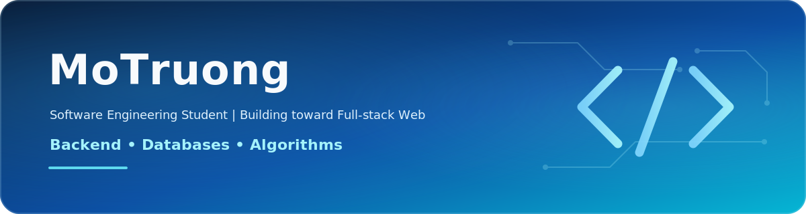

  

  
  

## About Me

I am a second-year student in the Computer and Information Technology group at the University of Science, Vietnam National University Ho Chi Minh City (HCMUS).

I am building a broad software engineering foundation as I work toward Full-stack Web development. My focus is on writing maintainable code and learning through practical projects.

## Current Focus

- Backend foundations with Node.js
- Databases and SQL Server
- Algorithms and problem-solving
- Frontend-backend interaction

## Technologies

### Currently Using

  
  
  
  

### Currently Learning

  
  
  
  
  
  
  

## Open to Collaboration

I am open to learning-oriented projects and open-source contributions with students and developers who value clear communication and constructive feedback.

## GitHub Overview

  <picture>
    <source media="(prefers-color-scheme: dark)" srcset="https://github-readme-stats.vercel.app/api?username=MoTruong&amp;show_icons=true&amp;hide_border=true&amp;bg_color=00000000&amp;title_color=60A5FA&amp;icon_color=60A5FA&amp;text_color=E5E7EB">
    <source media="(prefers-color-scheme: light)" srcset="https://github-readme-stats.vercel.app/api?username=MoTruong&amp;show_icons=true&amp;hide_border=true&amp;bg_color=00000000&amp;title_color=2563EB&amp;icon_color=2563EB&amp;text_color=1F2937">
    
  </picture>
  <picture>
    <source media="(prefers-color-scheme: dark)" srcset="https://github-readme-stats.vercel.app/api/top-langs/?username=MoTruong&amp;layout=compact&amp;hide_border=true&amp;bg_color=00000000&amp;title_color=60A5FA&amp;icon_color=60A5FA&amp;text_color=E5E7EB">
    <source media="(prefers-color-scheme: light)" srcset="https://github-readme-stats.vercel.app/api/top-langs/?username=MoTruong&amp;layout=compact&amp;hide_border=true&amp;bg_color=00000000&amp;title_color=2563EB&amp;icon_color=2563EB&amp;text_color=1F2937">
    
  </picture>

> Language stats are based on public repository contents and do not represent proficiency.

## Beyond Code

Gaming · Reading · Music · Sports

<strong>Tiếng Việt</strong>

## Giới thiệu

Mình là sinh viên năm hai thuộc nhóm ngành Máy tính và Công nghệ thông tin tại Trường Đại học Khoa học Tự nhiên, Đại học Quốc gia Thành phố Hồ Chí Minh (HCMUS).

Mình đang xây dựng nền tảng kỹ thuật phần mềm rộng để hướng đến phát triển Web Full-stack, với trọng tâm là mã nguồn dễ bảo trì và các dự án thực tế.

## Trọng tâm hiện tại

- Nền tảng backend với Node.js
- Cơ sở dữ liệu và SQL Server
- Thuật toán và giải quyết vấn đề
- Sự tương tác giữa frontend và backend

## Công nghệ

### Đang sử dụng

C++, Python, Git và SQL Server.

### Đang học

HTML5, CSS3, JavaScript, TypeScript, React, Next.js và Node.js.

## Hợp tác

Mình sẵn sàng tham gia các dự án định hướng học tập và đóng góp mã nguồn mở cùng sinh viên hoặc lập trình viên coi trọng giao tiếp rõ ràng và phản hồi mang tính xây dựng.

## Sở thích

Chơi game · Đọc sách · Âm nhạc · Thể thao

